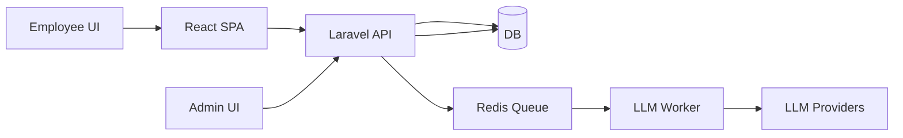

# KPI Task-Log & Evaluation Platform — Full Specification

Version: 0.1
Date: 2026-02-02
Author: Project Spec (generated)

## 1. Overview

This document is the full technical specification for a KPI task-log and evaluation platform intended to replace twice-daily emailed Excel task logs. The system supports: excel-like task logging, todo management, LLM-assisted categorization, role-based dashboards, monthly KPI evaluations (fusion of rule-based, LLM, and human scores), and an API-key repository with provider failover.

Scope (MVP): daily task submissions, todo management, per-submission LLM categorization, manager approval workflow, monthly evaluation draft generation, admin API-key management, RBAC.

## 2. Goals & Non-goals

- Goals:
    - Replace emailed Excel logs with structured submissions.
    - Provide easy, excel-like UI for batch entry.
    - Provide configurable work hours and breaks per user/role.
    - Use LLMs to categorize tasks into KPI categories.
    - Provide monthly KPI evaluations that combine rule-based scoring, LLM scoring, and manager/HR input.
    - Maintain a secure repo of API keys and perform provider failover.

- Non-goals (MVP):
    - Machine learning training pipelines (beyond storing labeled overrides)
    - Full HR payroll integration (out of scope)

## 3. Tech Stack (recommended)

- Backend: PHP 8.2+, Laravel 12
- Auth: Laravel Sanctum (SPA) + spatie/laravel-permission
- DB: MySQL / PostgreSQL (Redis for queues & caching)
- Frontend: React 19 + Vite, Tailwind CSS
- Queues: Redis + Laravel Queues (Horizon optional)
- Storage: S3-compatible for attachments
- LLM Providers: OpenAI, Anthropic, Cohere, custom HF endpoints
- Observability: Sentry, Prometheus/Grafana (infra)

## 4. High-level architecture

Mermaid sequence (simplified):



## 5. ER Diagram

```mermaid
erDiagram
    USERS ||--o{ TASKS : owns
    USERS ||--o{ TASK_LOGS : submits
    USERS ||--o{ TODOS : owns
    TASKS ||--o{ TASK_LOGS : has
    TASKS }|--|{ KPI_CATEGORIES : categorized_by
    TASK_LOGS }|--|{ KPI_CATEGORIES : categorized_by
    USERS ||--o{ MONTHLY_EVALUATIONS : evaluated
    API_KEYS ||--o{ LLM_REQUESTS : used_by
    TASK_LOGS ||--o{ COMMENTS : has
    TASKS ||--o{ ATTACHMENTS : has
    TASK_LOGS ||--o{ ATTACHMENTS : has
    AUDIT_LOGS ||--o{ USERS : about

    USERS {
      bigint id PK
      string name
      string email
      string password
      json settings
      timestamps
    }
    TASKS {
      bigint id PK
      bigint owner_id FK
      bigint assignee_id FK
      bigint parent_id FK
      string title
      text description
      decimal planned_hours
      enum status
      date due_date
      json metadata
      timestamps
    }
    TASK_LOGS {
      bigint id PK
      bigint task_id FK
      bigint user_id FK
      date date
      decimal duration_hours
      text description
      bigint kpi_category_id FK
      json llm_suggestion
      enum status
      bigint approved_by FK
      datetime approved_at
      json metadata
      timestamps
    }
    TODOS {
      bigint id PK
      bigint user_id FK
      string title
      text notes
      date due_date
      enum priority
      bool completed
      timestamps
    }
    KPI_CATEGORIES {
      bigint id PK
      string name
      text description
      decimal weight
      json metadata
      timestamps
    }
    MONTHLY_EVALUATIONS {
      bigint id PK
      bigint user_id FK
      smallint year
      tinyint month
      decimal score
      json breakdown
      string generated_by
      enum status
      bigint approved_by FK
      timestamps
    }
    API_KEYS {
      bigint id PK
      bigint user_id FK
      string provider
      string name
      text encrypted_key
      integer priority
      integer daily_quota
      integer daily_usage
      enum status
      datetime last_checked_at
      timestamps
    }
    COMMENTS {
      bigint id PK
      string commentable_type
      bigint commentable_id
      bigint user_id FK
      text text
      timestamps
    }
    ATTACHMENTS {
      bigint id PK
      string attachable_type
      bigint attachable_id
      bigint user_id FK
      string path
      string filename
      string mime
      integer size
      timestamps
    }
    AUDIT_LOGS {
      bigint id PK
      bigint user_id FK
      string action
      text old_values
      text new_values
      string ip_address
      datetime created_at
    }
```

## 6. Database Schema (table-by-table)

- `users` — standard Laravel users with `settings` JSON (shift start/end, breaks override)
- `roles` / `permissions` — use `spatie/laravel-permission`
- `tasks` — planned work items; supports parent/child, assignee, planned hours, kpi_category link
- `task_logs` — daily submissions (one or more rows per day). Key: `user_id`, `date`, `duration_hours`, `description`, `kpi_category_id`, `llm_suggestion` (json), `status` (pending/approved/rejected)
- `todos` — per-user todo items (for planning)
- `kpi_categories` — category definitions, weights, description
- `monthly_evaluations` — stored evaluation result per user/month with `breakdown` JSON
- `api_keys` — encrypted provider keys with status, priority, daily_quota, daily_usage
- `comments`, `attachments`, `audit_logs`

Indexes: common indexes on `user_id`, `date`, `status`, `kpi_category_id` and FKs.

## 7. API Contract (Representative endpoints)

Auth notes: Use Laravel Sanctum for SPA sessions or token-based. All `/api` endpoints are JSON. Use standard HTTP status codes.

1. Register

- POST /api/register
- Auth: public
- Body:

```json
{ "name": "string", "email": "string", "password": "string" }
```

- Response 201:

```json
{ "user": { "id": 1, "name": "...", "email": "..." }, "token": "..." }
```

2. Login

- POST /api/login
- Auth: public
- Body:

```json
{ "email": "string", "password": "string" }
```

- Response 200:

```json
{ "user": {"id":1,...}, "token":"..." }
```

3. Get current user

- GET /api/user
- Auth: Bearer or Sanctum cookie
- Response 200: user plus `roles` and `settings`

4. Tasks - List

- GET /api/tasks?assigned=true&status=open&from=2026-01-01&to=2026-01-31
- Auth: authenticated
- Perms: users see their tasks; managers see team
- Response 200: paginated tasks

5. Tasks - Create

- POST /api/tasks
- Auth: authenticated
- Body:

```json
{
    "title": "string",
    "description": "string",
    "assignee_id": 123,
    "kpi_category_id": 3,
    "planned_hours": 1.5
}
```

- Response 201: created task object

6. Task Logs - Batch Submit (core)

- POST /api/task-logs
- Auth: authenticated
- Purpose: submit multiple rows at once (morning plan or end-of-day actuals)
- Body:

```json
{
    "date": "2026-02-02",
    "rows": [
        {
            "task_id": 1,
            "duration_hours": 2.5,
            "start_time": "08:30",
            "end_time": "10:50",
            "description": "Worked on X",
            "priority": "high",
            "kpi_category_id": null
        }
    ],
    "shift_override": {
        "start": "08:30",
        "end": "17:30",
        "breaks": [{ "from": "10:30", "to": "10:50" }]
    }
}
```

- Response 202: accepted; returns ids and LLM-suggestion placeholders
- Behavior: API enqueues LLM classification job per-row or batched per-user/day.

7. Task Log - Approve

- POST /api/task-logs/{id}/approve
- Auth: manager
- Body: { "comment": "Looks good" }
- Response: 200 with updated status

8. Todos endpoints: /api/todos (CRUD) — standard

9. KPI endpoints

- GET /api/kpis — list categories and weights
- GET /api/users/{id}/kpis?year=2026&month=1 — returns monthly evaluations

10. Evaluations - Generate (admin/system)

- POST /api/evaluations/generate
- Auth: system/admin
- Body: { "year":2026, "month":1 }
- Response: 202 accepted with evaluation job id
- Behavior: enqueues aggregation job which runs rule-based scoring, calls LLM for summary/scoring, stores draft in `monthly_evaluations`.

11. API Keys - Admin

- GET /api/api-keys
- POST /api/api-keys
    - Body:
    ```json
    {
        "provider": "openai",
        "name": "key-prod-1",
        "key": "sk-...",
        "priority": 10,
        "daily_quota": 100000
    }
    ```
- DELETE /api/api-keys/{id}

12. Admin overview

- GET /api/admin/overview — metrics: missing submissions, late rates, LLM usage, keys health

Error format:

```json
{ "message": "Validation error", "errors": { "field": ["msg"] } }
```

## 8. Request/Response JSON Schemas (examples)

Task Log Row (input):

```json
{
    "task_id": 42,
    "duration_hours": 1.5,
    "start_time": "08:30",
    "end_time": "10:00",
    "description": "Fixed issue #123",
    "priority": "high",
    "kpi_category_id": null
}
```

Task Log Row (stored/returned):

```json
{
    "id": 987,
    "task_id": 42,
    "user_id": 11,
    "date": "2026-02-02",
    "duration_hours": 1.5,
    "description": "Fixed issue #123",
    "kpi_category_id": 3,
    "llm_suggestion": { "category": "Operational Support", "confidence": 0.93 },
    "status": "pending",
    "created_at": "..."
}
```

Evaluation object:

```json
{
    "id": 123,
    "user_id": 11,
    "year": 2026,
    "month": 1,
    "score": 8.4,
    "breakdown": { "Delivery": 8.0, "Support": 9.2 },
    "sources": { "rule_based": 7.9, "llm": 8.5, "manager": 8.8 },
    "status": "draft",
    "created_at": "..."
}
```

## 9. Auth & Roles

- Use Laravel Sanctum for SPA session tokens.
- Install `spatie/laravel-permission`.

Roles and baseline permissions:

- `employee` (submit logs, create todos, view own KPIs)
- `supervisor` (view team, approve/reject logs, write remarks)
- `hr` (view/publish evaluations, export)
- `management` (view org KPIs)
- `admin` (manage users, keys, settings)

Middleware: `role:supervisor` and `permission:approve_log` style gates.

## 10. LLM Integration Design

Objectives:

- Map free-text task descriptions to KPI categories per-row.
- Summarize monthly data into human-readable narratives.
- Provide confidence and top-N suggestions.

Design:

1. Light-weight rule-based classifier (regex/keyword + category lookup) runs first for cheap, deterministic mapping.
2. LLM worker runs asynchronously (Redis queue) on accepted submission batches. Worker groups rows per-user-per-day into batches to reduce tokens.
3. Prompting: fixed system prompt enumerating category names, definitions, and 6-10 examples; strict JSON output schema required.
4. Token optimization: compress examples, remove long descriptions, use succinct schema, send only minimal context.
5. Provider adapters: implement interface `LLMProvider::class` with methods `classify(rows):Suggestion[]` and `summarize(rows):Summary`.
6. Failover: API key manager selects healthy key; on 429/5xx, worker retries with exponential backoff and switches keys/providers per strategy.
7. Persistence: store raw LLM response, parsed suggestion (category, confidence), provider metadata, and request token usage for billing.

Prompt example (system + few-shot):

```
System: You map the following user task descriptions into one of these KPI categories: [Delivery, Support, Administration, Research]. Return JSON: {"category":"<one>","confidence":0.00,"reasons":"..."}

Example: "Fixed production API bug" -> {"category":"Support","confidence":0.98}
```

## 11. API Key Management Design

Schema: `api_keys` table (see ER diagram). Keys encrypted at rest (Laravel encryption or KMS). Store provider metadata (rate-limit headers mapping) in `meta` JSON.

Selection algorithm:

- Filter active keys for requested provider.
- Exclude keys exceeding daily_quota or marked degraded.
- Sort by priority ascending (lower = preferred) and last_checked_at success.
- Use round-robin within same priority if multiple keys.

Health & rate-limit detection:

- On each provider call, parse response headers: `X-RateLimit-Remaining`, `Retry-After`, etc.
- If 429 or repeated 5xx errors, increment error counter and mark key as `degraded` for a cooldown window (circuit-breaker).

Admin UI features:

- Add / rotate / disable key
- Test key (test request to provider)
- Show daily_usage, health graph, last_error

## 12. Scheduling and Workflows

- Reminders: daily reminders to users with missing submissions at 20:00 and 22:30 local time.
- Finalize day: nightly job at 23:59 to aggregate submissions and compute per-day metrics.
- Monthly evaluation: run at 00:05 on 1st of month to draft previous month evaluations, enqueue LLM summarization tasks and store drafts.
- Approval workflow: managers receive notifications on new pending logs; expected SLA: 48 hours to review.

## 13. Security & Privacy

- Encrypt API keys at rest (KMS recommended). Use HTTPS everywhere.
- RBAC via `spatie/laravel-permission` and middleware.
- Audit logs for all sensitive actions (submit/approve/key changes/export).
- File uploads: virus scan (optional), size limits, content-type checks.
- Data retention: configurable retention policies for raw LLM outputs; PII minimization for prompts (redact personal data before sending to external LLMs).
- Admin 2FA encouraged for critical roles.

## 14. Observability & Testing

- Log LLM calls (request/response, cost metrics), errors, and key health.
- Add unit tests for scoring rules, API endpoints, and E2E tests for core flows.
- CI pipeline to run PHPStan, Pest/PHPUnit, and basic frontend tests.

## 15. Milestones & Estimates (developer-days)

1. Scaffold & Auth (3d): Sanctum, users, spatie permissions
2. Data Model & APIs (7d): migrations, models, controllers, validation, tests
3. Frontend MVP (8d): TaskGrid, SubmissionForm, Dashboard (React)
4. LLM & Key Manager (5d): provider adapters, queue worker, admin UI
5. Approvals & Scheduling (5d): manager flows, scheduler, notifications
6. QA & Deployment (3d): tests, security hardening, docs

Total MVP: ~31 dev-days

## 16. Acceptance Criteria (MVP)

- Employee can submit daily task logs via an excel-like UI (single or batched rows) and set shift/break overrides.
- Submitted rows are persisted and show LLM suggestions for categories.
- Manager can view, approve, reject logs and add remarks.
- System generates monthly evaluation drafts combining rule-based and LLM inputs; manager/HR can publish final scores.
- Admin can add/rotate API keys and view key health; system uses failover on rate limits.
- RBAC enforced; audit logs recorded for critical actions.

## 17. Next Steps (implementation options)

- I can scaffold the DB migrations and models next (recommended), or produce the full API controller skeletons and route definitions.
- Choose next: `migrate+models` or `api-skeleton` or `frontend-skeleton`.

---

Saved to: docs/kpi-platform-spec.md

Please tell me which implementation step to start next.
